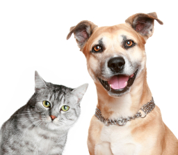

# CatClassifier

This is a template for ICS 637 Spring 2023 Homework 2. The task is to train a CNN to classify cats from dogs.

# Instructions

1. Download dataset from google drive. It is recommended to start with the small dataset (130MB), which contains approximately 3000 images in the training set and 2000 in the test set. This training dataset is a subsample from the full dataset (500+MB). ([link](https://drive.google.com/drive/folders/1j5OxsMlk86OErVaWMRU3qLb3UtuQue7L?usp=share_link)).
1. Build and train a ConvNet classifier on the training set. You may use any of the common deep learning frameworks. *You may not use a pretrained model.*
1. Tune hyperparameters. You may use the test set to do model selection, as long as you explicitly explain in your evaluation that this results in an overestimate of performance.
1. Evaluate the model on the test set. Plot the ROC curve and compute the AUROC.

## Details
- Use a convolutional neural network architecture (do not use a pretrained architecture).
- Use an appropriate loss function.
- Use early stopping to avoid overfitting.
- Use data augmentations to avoid overfitting.

## Submission

Submit your work as Jupyter notebook in a github repo to Github classroom.
- Make sure your name is clearly visible at the top.
- Include the ROC plot in the notebook.
- Include a description of your evaluation.
- I won't run your code, but it should be readable.
- Don't upload the dataset to github.

## Tips
- Pytorch provides the [ImageFolder](https://pytorch.org/vision/main/generated/torchvision.datasets.ImageFolder.html) module to make it easy to work with directories of images. Tensorflow provides similar tools.

